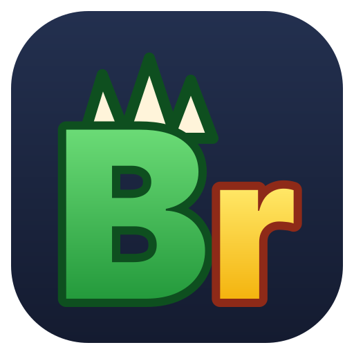

<p align="center"></p>

<h1 align="center">BrOWSER</h1>

<p align="center">Extensão para Chrome, Edge e Brave que preenche formulários da página aberta a partir de um pedido em linguagem natural, usando a <b>assinatura de IA que você já paga</b> (Google AI Pro, ChatGPT ou Claude) — sem chave de API.</p>

<p align="center"><a href="https://saironbusatto.github.io/BrOWSER/">saironbusatto.github.io/BrOWSER</a></p>

---

## Como funciona

```
Painel lateral (extensão) ──► Ponte local (bridge) ──► Ferramenta oficial da IA (agy / codex / claude)
                                   ▲                              │
                                   └──── ferramentas MCP ◄────────┘
                                         (ler campos, preencher, clicar)
```

- A **extensão** lê e preenche a página (via `chrome.debugger`, com plano B pelo DOM).
- A **ponte** é um programa pequeno instalado no seu computador que liga a extensão à ferramenta oficial da IA, logada com a sua assinatura. Uma extensão sozinha não pode executar programas — por isso a ponte existe.
- A IA **nunca envia o formulário**: ela preenche e para; quem clica em Enviar é você. Isso não é só
  instrução no prompt — a ponte **recusa, por código**, o clique em botão de envio final e devolve a
  decisão para você.
- O painel tem **botão Parar**: derruba a IA no instante, sem esperar. Soberania sua, não da máquina.

## Instalar

Um pacote por plataforma, com a ponte **e** a extensão dentro. Nenhum passo exige
`root`, administrador, Node, Bun ou `npm install`.

**Antes de instalar**, o binário diz se a máquina tem o que o BrOWSER precisa. Ele confere
navegador, registro da ponte e as ferramentas de IA instaladas e logadas, sai com código 1
enquanto faltar algo, e diz o que fazer.

```bash
./bridge --doctor                                        # Linux
"%LOCALAPPDATA%\BrOWSER\bridge.exe" --doctor              # Windows
```

### Windows

1. Baixe `BrOWSER-windows.zip` em [Releases](https://github.com/saironbusatto/BrOWSER/releases) e **extraia** (não clique dentro do zip: o Windows copiaria só o arquivo clicado, e o instalador não encontraria o resto).
2. **Clique duas vezes em `instalar.cmd`.** O instalador mostra o que vai mudar no seu computador e onde os seus dados vão, e pergunta antes. Não precisa de administrador, nem de Node, Bun, Python ou npm.
3. Se o Antigravity CLI (`agy`) não estiver instalado, ele mostra a URL do instalador oficial do Google e pergunta se quer instalar. **Ele não baixa nada por conta própria.**
4. **Reinicie o navegador** e carregue a extensão de dentro da pasta extraída: `chrome://extensions` → Modo do desenvolvedor → Carregar sem compactação → a pasta `extensao` que está ao lado do `instalar.cmd`.
5. Confira com `"%LOCALAPPDATA%\BrOWSER\bridge.exe" --doctor`.

Se preferir o terminal, ou se a janela do `.cmd` não abrir (política de empresa ou antivírus podem bloquear `.cmd`), o instalador é o `setup.ps1` e roda direto:

```powershell
powershell -NoProfile -ExecutionPolicy Bypass -File .\setup.ps1
```

Por que um `.cmd` e não um `.ps1` na mão: o duplo clique em `.ps1` ora abre no Bloco de Notas em vez de executar, e a `ExecutionPolicy` padrão recusa script baixado da internet. O `.cmd` resolve os dois, segura a janela aberta para o resultado poder ser lido, e é o que a pessoa clica.

### Linux

1. Baixe `BrOWSER-linux.tar.gz` em [Releases](https://github.com/saironbusatto/BrOWSER/releases) e extraia.
2. Rode `./install.sh`. Sem `root`: a ponte vai para `~/.local/share/BrOWSER` e o registro para `~/.config`.
3. **Reinicie o navegador** e instale a extensão de dentro do pacote em `~/.local/share/BrOWSER/extensao`: `chrome://extensions` → Modo do desenvolvedor → Carregar sem compactação.
4. Confira com `~/.local/share/BrOWSER/bridge --doctor`.

**Carregar a extensão é sempre manual, e é decisão do Chrome**, não limitação nossa: um
navegador comum não deixa nenhum programa instalar extensão sem a sua confirmação. Só em
ambiente gerenciado (empresa, escola, kiosk) dá para distribuir a extensão já instalada.

E não dê duplo clique no `install.sh`: no Linux isso **abre o código no editor de texto**.
É por terminal — `./install.sh`, ou botão direito → "Executar em um terminal".

### macOS

Ainda não há binário publicado para macOS. O código funciona, mas o release não traz
executável: até lá, o caminho é compilar a ponte a partir do código.

### A ferramenta de IA

O BrOWSER usa **a sua assinatura**, nunca uma chave de API: `agy` (Google AI Pro),
`codex` (ChatGPT) ou `claude` (Claude Pro/Max), conforme o plano que você conectar no
painel. Cada uma tem instalador oficial próprio e **o BrOWSER não instala nenhuma** —
escolher qual usar é seu. O `--doctor` diz o que falta. Python 3 só é necessário para o
login do Google AI Pro, que exige terminal interativo.

## Desinstalar

- **Windows:** Configurações → Aplicativos instalados → BrOWSER → Desinstalar (ou o atalho "Desinstalar BrOWSER" no Menu Iniciar). Remove a ponte, os registros nos navegadores e os dados locais.
- **Linux:** `~/.local/share/BrOWSER/install.sh --desinstalar` (ou `bridge --uninstall` para só tirar o registro e os dados locais).
- **Depois, remova a extensão do navegador** — em nenhum dos casos isso é automatizável.

## Privacidade

- O BrOWSER **não envia dados para os autores do projeto**. Não há servidor nosso.
- O conteúdo da página vai para a IA que **você** conectou (Google, OpenAI ou Anthropic) **somente quando você faz um pedido** no painel. Campo de senha nunca é lido: a extensão sabe que o campo existe (para poder preenchê-lo) mas não lê o que está dentro.
- A ponte baixa do GitHub um índice público de mapas de sites e, se houver, o mapa do site aberto — sem enviar dados seus.
- O "aprendizado de formulários" é **desligado por padrão** e guarda **só a estrutura** das páginas
  (rótulos e botões, sem valores e com dados pessoais mascarados), no seu computador. Mesmo ligado, ele
  **nunca** aprende páginas de login ou de pagamento, e campo de senha nunca entra no mapa. Liga em
  Assinaturas → Aprendizado de formulários.
- Política completa: [docs/termos-e-privacidade.md](docs/termos-e-privacidade.md).

## Desenvolvimento

```bash
bun install
bun run verificar          # lint + typecheck + testes
bun run test:coverage      # relatório de cobertura
bun run lint:fix           # corrige o que dá
bun run --cwd packages/extension build          # extensão em packages/extension/.output/chrome-mv3
bun run --cwd packages/bridge build:dev         # ponte de desenvolvimento (mantém o /control do spike)
bun run --cwd packages/bridge build             # ponte de release (/control inalcançável)
bun run --cwd packages/bridge install-host      # registra a ponte (Linux/macOS, a partir do código)
bun run spike <agy|codex|claude>                # teste de ponta a ponta no formulário de exemplo
```

Decisões do projeto: [docs/decisoes.md](docs/decisoes.md).

## Code signing policy / Política de assinatura de código

> Status: **solicitação à SignPath Foundation em preparação** — os binários atuais ainda não são assinados.

**EN.** Free code signing provided by [SignPath.io](https://about.signpath.io), certificate by [SignPath Foundation](https://signpath.org) (once approved). Only artifacts built by this repository's GitHub Actions workflows from this repository's source code are signed.

- Committers and reviewers: [saironbusatto](https://github.com/saironbusatto)
- Approvers: [saironbusatto](https://github.com/saironbusatto)
- All team members use multi-factor authentication on GitHub and SignPath.

**Privacy policy.** This program will not transfer any information to other networked systems unless specifically requested by the user or the person installing or operating it. Page content is sent only to the AI provider the user connected (Google, OpenAI or Anthropic), and only when the user submits a request in the side panel. The bridge downloads a public index of site maps from this GitHub repository without sending user data.

**PT.** Assinatura de código gratuita fornecida pela SignPath.io, com certificado da SignPath Foundation (após aprovação). Só são assinados os artefatos compilados pelos workflows deste repositório a partir deste código-fonte. Papéis e privacidade como acima.

## Licença

[Apache-2.0](LICENSE)
